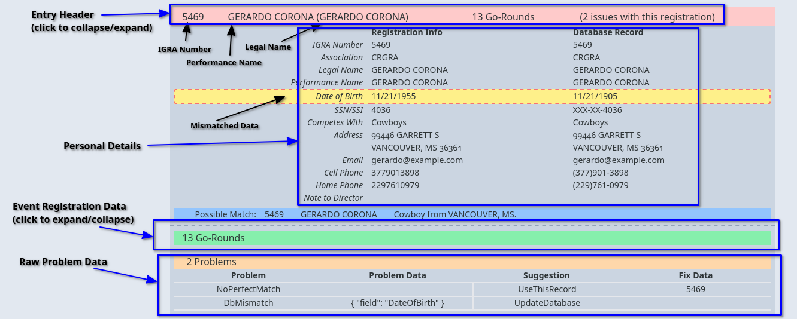

# IGRA[^1] Registration Data Validator

This application reads database files used by IGRA's existing (outdated) data management system.
It uses that data to validate externally-sourced rodeo registration data.
In particular, it expects input in a format produced by our new registration site,
and is meant to ease the burden as we transition to a more modern, integrated platform.

It can validate entries, search the database for closely matching records,
highlights registration errors and changes in registrant's personal data,
and suggests potential fixes whenever reasonable.

Though the program can operate as a command line application,
it includes an integrated HTTP server for these features,
and this project includes a web UI to make it easier to use.
You can see a live version of it (that uses randomly generated data)
at [https://saites.dev](https://saites.dev).


[^1]: This project and code are NOT officially affiliated with IGRA.
      This and any other names and brands may be claimed as the intellectual property of others.


## Quick Start

1. Download a pre-built bundle for your operating system.
2. Unpack the bundle somewhere convenient.
3. Open a terminal/command window in that directory.
4. Optionally, generate a random database: `./converter gen_db RANDOM.DBF`
   (or `.\converter.exe gen_db RANDOM.DBF` on Windows).
   If you have a database you already intend to use, in instructions below,
   substitute `RANDOM.DBF` with the path to that file.
5. Run a local version of the server: `./converter serve RANDOM.DBF 8080`.
   You can use a different port number than `8080` if you'd like.
6. Open a browser and navigate to `http://localhost:8080`
   (or whatever port you chose earlier).


### Using the Web Interface

To validate registration data, paste it into the text box on the `Registration` tab,
then click the `Validate` button just below it.
If you don't have any registration data yet, you can generate random data using the `Generate` button.
The slider next to the `Generate` button controls how many people will be included.

The validation results appear below the window.
Each result is a "Summary" view of details about the registration,
and initially these are all show collapsed.
Those with validation issues display visual indicators of their problems.



Click the summary line to expand a registration.
Initially, this shows just the database record data compared to the given registration info.
Another (initially collapsed) summary view hides their specific event registrations.
If there are problems with the registration, the relevant fields of these view are highlighted;
in addition, there will be a third summary with a "raw" view of the problems and potential solutions.

To search the database by name or IGRA number,
switch to the "Search" tab by clicking "Search" at the top of the page.
In the "Name" box, enter a performance name, legal name, IGRA number,
or potentially a combination of these.
As you type, the view will update with potential matches, ranked by plausibility.


## Command Line Usage

Commands take one of the following forms:

```
./converter gen_db RANDOM_DATABASE.DBF
./converter gen_reg RANDOM_DATABASE.DBF random-registration.json

./converter search SOME_DATABASE.DBF "Performance Name"
./converter search SOME_DATABASE.DBF "Performance Name | 1234"
./converter search SOME_DATABASE.DBF "Performance Name | 1234" "LegalFirstName" "LegalLastName"

./converter validate SOME_DATABASE.DBF registration-data.json

./converter serve SOME_DATABASE.DBF
./converter serve SOME_DATABASE.DBF 443
```

### Generating Random Data

The `gen_db` and `gen_reg` commands generate random data for testing purposes.
Use `./converter gen_db RANDOM.DBF` to write a database full of random people to `RANDOM.DBF`.
Use `./converter gen_reg RANDOM.DBF registration.json` to use that database
to generate a JSON file with random, but valid, registration data.

These both try to generate plausible data.
The `gen_db` command generates names and addresses using the content of these `./data/*.txt` files:
- `associations.txt`
- `common_cities.txt`
- `common_first_names.txt`
- `common_last_names.txt`
- `common_regions.txt`
- `common_street_endings.txt`
- `common_streets.txt`

These files are lists of strings with lines matching the data implied by the filename.
The command `gen_db` generates 8,000 records with names randomly picked from the name lists.
These should each have good number of unique names (say about 1,000) to keep duplicates down.
A database full of people with the same name is not only unrealistic,
it'll make validation essentially impossible, since we won't be able to determine partners in most cases.

The `gen_reg` command starts by selecting a random set of people from the given database,
has them each "register" for a random subset of solo events,
then pairs people up randomly for team-events, making sure to satisfy composition restraints.
Although it generates valid registration data (exclusive of any bugs in the implementation),
the algorithm picks among different ways of writing partner names,
and in some cases, the "chosen" way of writing the name will lead to ambiguity during validation.


### Searching the Database

Use `./converter search RANDOM.DBF "freddie mercury"`
to search the database for names most similar to the name `freddie mercury`.

When there's a single, perfect match, it'll be printed.
Otherwise, this prints all possible matches in order of plausibility.
There can be several hundred results, so it may be helpful to limit the results,
e.g. `./converter search RANDOM.DBF "freddie mercury" | head -50`.

With a single argument, it treats the input like a "partner name",
which tries to match the input against IGRA number, performance names, and legal names.
This is what the validation process does when trying to match "Partner" registration fields.
To this point, you can use arguments like "1234", "Some Name | 1234", or "1234 | Some Name"
to give higher rank to results that better match an IGRA number and (possibly empty) name fields.
This can also filter out results that are deemed too unlikely.

If you also have a legal name to search for, you can give these as addition arguments,
and they'll be treated like the "First" and "Last" name fields on registration.
For example, `"Freddie Mercury | 1946" "Farrokh" "Bulsara"`
looks for IGRA numbers like "1946", performance names like "Freddie Mercury",
first names like "Farrokh", and last names like "Bulsara".
This is very similar to how the validation algorithm searches for the registrant,
though in the "real" case, the user gives their IGRA number and performance name explicitly,
whereas this uses the same extraction approach as is done for Partner fields, mentioned above.

### Validating Registration Data

You can use the command line directly to validate a JSON file containing registration data.
The validation result, the same as used by the web UI, will be written to standard out.
For example, use `./converter validate RANDOM.DBF random-reg.json`
to read in `random-reg.json` and validate it against the data in `RANDOM.DBF`.


### Serving the Database

WARNING: The server has no authentication or authorization mechanisms.
         DO NOT RUN THE SERVER ON THE PUBLIC INTERNET USING PEOPLE'S REAL, PERSONAL DATA.

Use `./converter serve RANDOM.DBF 8080` to run the HTTP server on port `8080` using `RANDOM.DBF`.

The server exposes the following endpoints:

- `/` serves the contents of `./web`; in the future, these might get baked into the build.
- `/validate` accepts a registration data and returns validation results.
- `/generate` generates and returns random registration data.
- `/search` accepts a query and returns records with similar names.


For now, the schemas used for these APIs are "undocumented" outside the code itself,
which simply uses `serde_json` to serialize and deserialize them to/from Rust structs.

#### Serving Using TLS

To serve using TLS running on port 443, you'll need to have:

1. The certificate chain is available in `./certs/intermediate.cert.pem`.
2. The matching private key is available in `./certs/private.key.pem`.
3. You have the permissions necessary to listen on a privileged port.

That last point of course applies to binding to any port 1024 or below.
There are a number of ways to handle it, depending on your security goals,
but of course the simplest is to run the server via `sudo`.
Better ways include:
- set `CAP_NET_BIND_SERVICE`
- configure `iptables` to redirect to a higher port and bind to that
- use `sysctl` to drop the start point of unprivileged ports


#### Deploying to a VCS

WARNING: The server has no authentication or authorization mechanisms.
         DO NOT RUN THE SERVER ON THE PUBLIC INTERNET USING PEOPLE'S REAL, PERSONAL DATA.

The `Makefile` has to targets to help with deployment.
Use `make bundle` to generate the production files and `tar` them up into a useful form.
Use `make deploy` to `scp` it to a host identified as `igra` and run a `deploy.sh` script there.

For this to work, you'll need an `igra` block in your `~/.ssh/config` file,
and an appropriate `deploy.sh` script on the server.
The experience is improved if your host machine SSH keys are in the server's `.ssh/authorized_keys` file ;)

```
Host igra
    User ec2-user
    Hostname <some ip address>
```

The deploy script should backup the old version, extract the `tar` bundle, and restart the server.
A minimal version of such a script might look like:

```bash
#!/usr/bin/env bash

rm -rf old old-web
mv new old && mv web old-web
tar -xf bundle.tar

ps aux | awk '/root.*\.\/new serve/ { print $2 }' | xargs kill
nohup ./new serve ./data/RANDOM.DBF 443 &
```


## Building From Source

This assumes you're familiar with and have installed tools such as `git`, `docker`, `compose`, and `make`.
If you don't yet have a Rust tool-chain installed, go install `rustup` and `cargo`, then come back here.

Clone this repository and navigate to the resulting directory.

When developing the `converter` application, it's usually best to use `cargo` directly.
For example, you can use `cargo run gen_db ./data/RANDOM.DBF` the same way you'd call the commands above.


When developing the web UI, the `Makefile` provides several useful targets that improve the experience.

For local web development:
- Edit `web/converter-app/vite.config.js` to set `hostname` to, e.g.
  `const hostname = "http://<your local machine's LAN address>:8080"`.
- Use `make serve-local-release vite` to run the API and web servers using `docker compose`.

  The `docker-compose.yaml` file maps port 8081 to the server in the container,
  so you can go to `http://localhost:8081` to view/interact with the UI.
  API requests are forwarded from the server to the host and port you configured above,
  so requests for e.g. `http://localhost:8081/validate` go to `http://<your host>:8080/validate`.
  Editing web UI files will trigger it to automatically rebuild/reload.

- Run the API server locally using `make serve-local` or `make serve-local-release`.
  The latter takes longer to build, but serves requests much faster.
  If you're primarily developing the web UI, it's the better choice.
  If you're primarily developing the API server, but need the UI for some reason,
  then you can use the former to more quickly iterate the build process.
- Use `make vite` to run the dev server in a container.

For production:
- Use `make build` to build the production API server and web distribution.
- Use `make bundle` to bundle the assets into a tar file.
- Use `make deploy` to deploy it to a properly-configured production server;
  see the notes on the `deploy` target for how to set up this configuration.


## License

This is a project with an intentionally limited shelf-life
and will no longer be developed once we have a fully-integrated registration and data system.

Nevertheless, parts of this application may prove useful to others,
(namely, the DBF and BKTree implementations),
and so it is made available to you under the GNU General Public License version 3:

>   Copyright (C) 2023  Alexander J. Saites
>
>   This program is free software: you can redistribute it and/or modify
>   it under the terms of the GNU General Public License, version 3,
>   as published by the Free Software Foundation
>
>   This program is distributed in the hope that it will be useful,
>   but WITHOUT ANY WARRANTY; without even the implied warranty of
>   MERCHANTABILITY or FITNESS FOR A PARTICULAR PURPOSE.  See the
>   GNU General Public License for more details.
>
>   You should have received a copy of the GNU General Public License
>   along with this program.  If not, see <https://www.gnu.org/licenses/>.

The full text of the license is available in [COPYING]().

Note that 3rd-party dependencies are provided under their own licenses.
